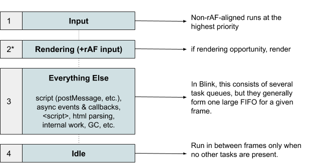
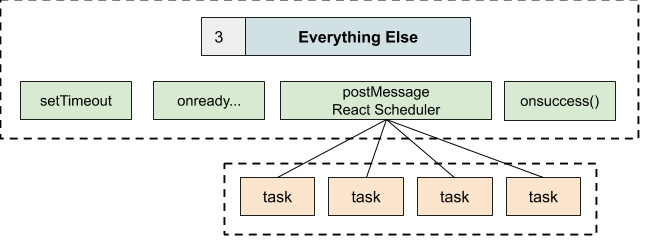

# Main-thread Scheduling API
For an overview, see: [Slides presented at TPAC 2018](https://docs.google.com/presentation/d/12lkTrTwGedKSFqOFhQTsEdcLI3ydRiAdom_9uQ2FgsM/edit?usp=sharing)

Also this [talk from Chrome Dev Summit](https://youtu.be/mDdgfyRB5kg) covers the problem and larger direction.

## Motivation: Main thread contention
Consider a "search-as-you-type" application:

This app needs to be responsive to user input i.e. user typing in the
search-box. At the same time any animations on the page must be rendered
smoothly, also the work for fetching and preparing search results and updating
the page must also progress quickly. 

This is a lot of different deadlines to meet for the app developer. It is easy
for any long running script work to hold up the main thread and cause
responsiveness issues for typing, rendering animations or updating search
results.

This problem can be tackled by systematically chunking and scheduling main
thread work i.e. prioritizing and executing work async at an appropriate time
relative to current situation of user and browser. A Main Thread Scheduler
provides improved guarantees of responsiveness.

## Improving User Experience Through Better Scheduling

As the [example above](#motivation_main_thread_contention) illustrates, modern
web apps are complex and often consist of multiple ongoing operations. These
tasks may also have varying degrees of importance in terms of how they affect
user experience. For example, consider a tile-based app like Maps. The app
might load all of the tiles in the viewport and and some just outside. From the
user's perspective, however, it's more important to load the tiles in the
viewport than those that are off-screen. But at the same time, apps are dynamic
and user input may change the relative importance of tasks at any moment. In
Maps, the relative importance changes when the user starts panning, with tiles
that are just outside the viewport becoming more important.

Determining which tasks should run at a given moment is the primary function
of a scheduler, and userspace schedulers have been designed for this very
purpose (see also [userspace scheduler case studies](#UserspaceSchedulers.md)).
To give the responsiveness guarantees that apps require however, improved
scheduling APIs are needed.

There are two approaches we could take to improve scheduling on the Web, both
of which we intend to explore.

First, we could incrementally improve userspace schedulers by exposing *better
scheduling primitives*. Existing userspace schedulers have been successful in
improving user experience, but are limited by gaps in
[knowledge](UserspaceSchedulers.md#4a-knowledge) and
[coordination](UserspaceSchedulers.md#4b-coordination). Shipping new scheduling
primitives that fill these gaps can further enable Javascript / userspace
schedulers to succeed. See [Low Level Scheduling APIs](#LowLevelAPIs.md) for a
list of APIs we are currently exploring.

Second, and the focus of the rest of this document, is to build a native
scheduler in the browser that is directly integrated into the browser's event
loop.

## A Native Scheduling API

Providing a native scheduler in the Platform has several advantages:
 1. **Userspace Coordination**: Userspace schedulers are fundamentally limited
by their *boundaries*, which is to say userspace schedulers are only effective
for the tasks they have control over. If multiple entities are sharing the main
thread, i.e. app, framework, 3P code, then schedulers are limited without
coordination. The browser is cventrally positioned to coordinate scheduling
between everything sharing the main thread.

 2. **Browser Coordination**: A common agreed upon library could remedy (1)
    (assuming everyone agrees on a single library), but there is still a
coordination problem with browser tasks, e.g. fetch responses, internal tasks,
etc. A native scheduler could provide coordination among **all** tasks sharing
the main thread.

 3. **A Unified API**: There is currently has a disparate set of scheduling
APIs, making it onerous for developers to write scheduling code. It takes
expert knowledge of the Browser's event loop to write scheduling code, and
adding more low-level APIs will likely exacerbate this. Creating a unified
native scheduling API can alleviate this.

### Priority-Based Web Scheduling and Current Model

Schedulers commonly use some notion of **priority** to decide which task should
run next.

The Web Platform currently exposes a few priorities through a
disparate set of APIs. `requestAnimationFrame()` is used to run tasks with
frame-timing; `requestIdleCallback()` is used to post background work that can
be potentially starved indefinitely; and `setTimeout(0)` or `postMessage()` are
used to run tasks at *default* priority between frames.

Browsers have some control over how tasks of different types are scheduled ---
for example, input tasks may be prioritized --- but, generally most tasks run
at the same priority level.

In Chromium, for example, the per-document priority model looks like the
following:



The userspace schedulers that apps like Maps and frameworks like React use must
operate *within* this priority system.

For example, the React scheduler runs between frames using `postMessage()`:



This illistrates the coordination issue described above: the tasks within the
scheduler cannot be effectively ordered with tasks outside of the scheduler.

### Proposed API Surface

#### Priorities

The native scheduler's foundation is a set of shared priorities that can be
used for tasks posted directly through the scheduler, i.e.
`scheduler.postTask()`, and for indirect tasks such as `<script>` tag
processing and `fetch()` completions. Much of the initial API version will
focus on how to expose these priorities to developers, and what the semantics
of the priorities are (see also [this
doc](https://docs.google.com/document/d/1AATlW1ohLUgjSdqukgDx3C0P6rnJFgZavmKoZxGb8Rw/edit?usp=sharing)
for an in-depth discussion of priority systems and semantics).

Minimally, new priorities are needed above and below the existing "default"
priority, and we propose beginning with two additional new priorities as well:


(**Note**: These priorities determine the order that tasks run for an individual
*document*, but between tasks in documents that share the same thread. The
browser may choose to throttle certain frames, e.g. when not visibile, so the
priority system is not global across documents. In other words, a high-priority
task in a low-priority document is likely not high-priority overall.

1. **Immediate**: Immediate priority tasks run as soon as the scheduler regains
control, and will generally run before rendering and user input (except for
throttled documents).

2. **Input** (experimental): There's a use case for ensuring input events run
at the highest priority but can still be chunked to enable smooth animations.
Scheduling input events at high priority might cause unacceptable delay, so we
plan to experiment with a separate queue that can only be posted to from input
events.

3. **High**: The highest priority for inter-frame script that still (generally)
yields to rendering. This can be used for important tasks that need to run
before most other work, e.g. processing for content that should be visible as
soon as possible.

4. **Default**: This priority is used for most existing tasks and should be
used for work that doesn’t need an elevated priority.

5. **Low**: Low priority can be used to deprioritize work that is not as
important relative to high and default, but still is still more important than
idle work. We envision “low” priority being an option for async events and
`<script>`, but not idle.

6. **Idle**: Idle is for background work, and idle tasks will only run if no
other tasks are runnable. These tasks compete only with other idle tasks and
`requestIdleCallback()`.

#### Global Task Queues and Priority Semantics

The scheduler (per-document, global scope) will maintain a set of global serial
task queues with the priorities listed above. The scheduler will select the
oldest task from the highest priority task queue as the next task to run.

We propose starting with a static (or fixed) priority system, meaning that the
scheduler will not change the priority of tasks over time (compared to dynamic,
e.g. priority aging). Userspace code can, however, change task priorities.

(**Note**: there are myriad options for which priority system to use in terms of
how priority changes over time and how tasks (priorities) are isolated from each
other. We are proposing to start with the simplest approach (global set task
queues with static priorities), but the model may change to something more
complex depending on initial feedback and usage.)

E.g. Posting a task through `window.scheduler`:

```
function importantWork() {
  ...
}

let task = scheduler.postTask(importantWork, {priority: 'high'});
...
```

E.g Chaining together dependent scheduled tasks (not microtask timing).

```
async function doMoreWork() {
  // Tasks are posted at default priority. schedule() is a global function that
  // integrates with window.scheduler.
  let res1 = await schedule(doSubTask1);
  let res2 = await schedule(doSubTask2);
  return res1 + res2;
}

```

#### Canceling Tasks and Changing Task Priorities
Tasks might need to be canceled or their priorities changed, for example if a
user interaction changes what an app needs to do next.

```
let nextTask = scheduler.postTask(renderAwesomeThing);

function amazingButtonClicked() {
  if (nextTask)
    nextTask.cancel();
  nextTask = scheduler.postTask(renderMoreAwesomeThing);
}
```

E.g. Change a task priority by moving it to a different global task queue.

```
let importantPendingTask = scheduler.postTask(renderAwesomeThing, {priority: 'high'});

...

scheduler.taskQueue('low').take(importantPendingTask);
```

#### Continuation support
Chunking tasks is important for responsiveness since tasks run to completion,
but yielding to higher priority work like input and rendering can have negative
consequences. This is because of the high cost of regaining control, since
posting a new task (e.g. via `postMessage`) will cause it to be queued at the
end, possibly behind any number of tasks.

Continuation support is providing the ability for tasks to yield to higher
priority tasks and resume control, without tasks of the same or lower priority
running first.

E.g. Yielding and continuation with `scheduler.yield()`. By default,
`scheduler.yield()` yields to all work queued in higher priority task queues,
and work queued as a result.

```
async function doWork() {
  while(true) {
    let hasMoreWork = doSomeWork();
    if (!hasMoreWork) return;
    await scheduler.yield();
  }
```

#### Delayed task posting

Essentially a prioritized version of setTimeout():

```
function runAfterTwoSeconds() {
  ...
}

let delayedTask = scheduler.postTask(runAfterTwoSeconds, {priority: 'high', delay: '2000'});

```

**'Virtual', or user-defined task queues**: Developers can define their own
  "virtual" serial task queues to manage groups of tasks.

```
function doWork() {
  ...
}

let myQueue = new TaskQueue('default');
myQueue.postTask(doWork);
```

User-defined task queues enables the app to manage a group of tasks, such as
updating priority, canceling, draining (synchronously executing tasks) when the
page is hidden, etc.

Updating priority of entire queue: ```myQueue.setPriority(<new priority>);```

Flushing the queue: ```myQueue.flush();```

Canceling all tasks in the queue: ```myQueue.clear();```

## Further Reading

* [MVP Proposal](https://docs.google.com/document/d/1AATlW1ohLUgjSdqukgDx3C0P6rnJFgZavmKoZxGb8Rw/edit?usp=sharing)
* [Priority-Based Web Scheduling](https://docs.google.com/document/d/1AATlW1ohLUgjSdqukgDx3C0P6rnJFgZavmKoZxGb8Rw/edit?usp=sharing)
